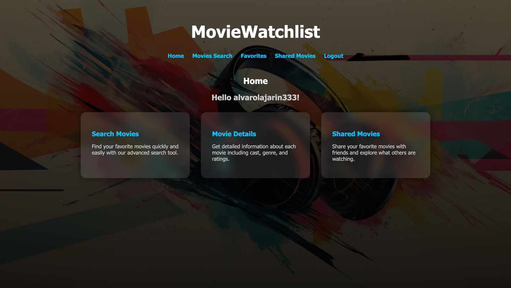
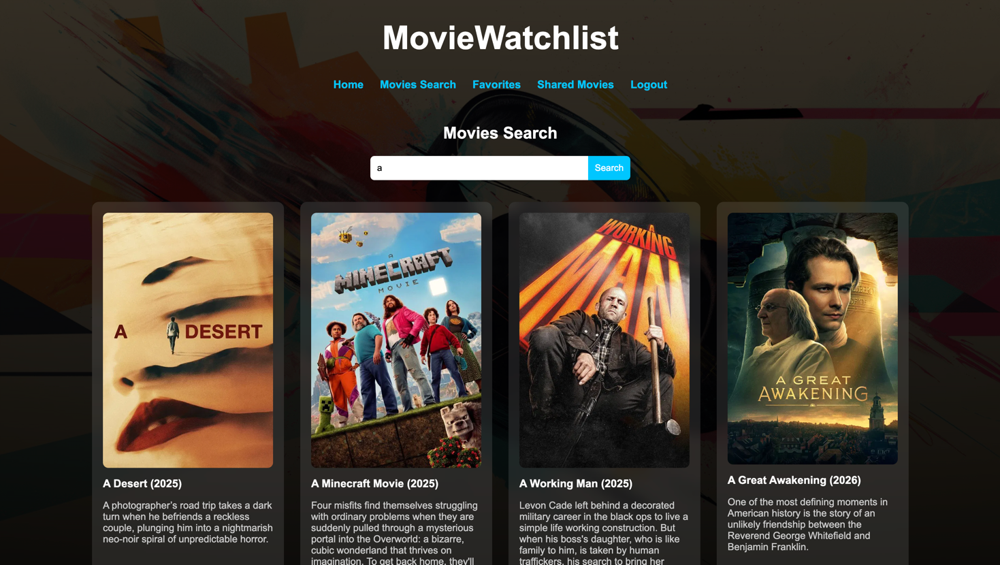
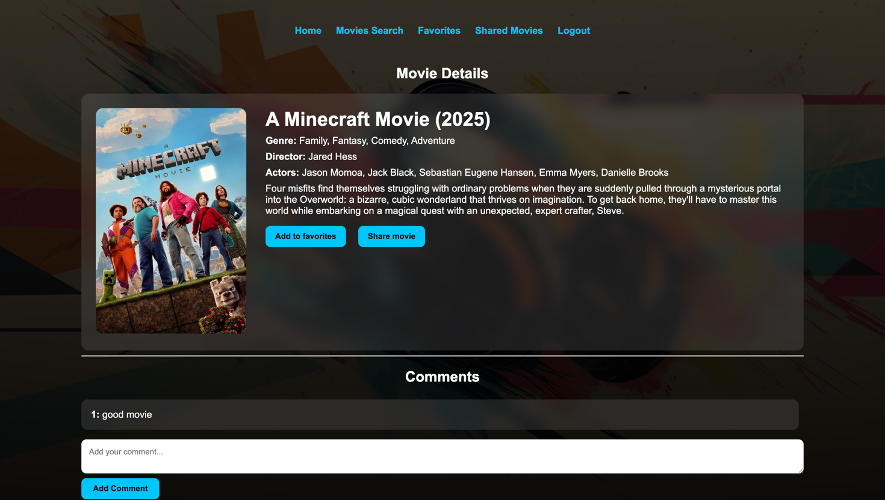

# Movie Watchlist

Aplicación web para buscar películas, guardar favoritos y compartir recomendaciones con otros usuarios.

---

## Descripción

Movie Watchlist permite a los usuarios registrarse, iniciar sesión y explorar películas usando la API de **The Movie Database (TMDB)**. Cada usuario puede ver el detalle de cualquier película, dejar comentarios, marcarla como favorita y compartirla con la comunidad.

---

## Capturas de pantalla


Home



Search



Detail



---

## Funcionalidades

| Funcionalidad | Descripción |
|---|---|
| Registro / Login | Creación de cuenta con email y contraseña |
| Búsqueda de películas | Búsqueda en tiempo real contra la API de TMDB |
| Detalle de película | Sinopsis, director, actores, géneros y póster |
| Comentarios | Los usuarios autenticados pueden dejar comentarios en cada película |
| Favoritos | Marcar/desmarcar películas como favoritas |
| Películas compartidas | Compartir películas para que aparezcan en el listado público |

---

## Tecnologías

- **Backend:** PHP 8 · CodeIgniter 4
- **Base de datos:** MySQL 8.4
- **Servidor web:** Nginx (Alpine)
- **Contenedores:** Docker / Docker Compose
- **API externa:** [The Movie Database (TMDB)](https://www.themoviedb.org/)
- **Herramientas de desarrollo:** phpMyAdmin · Xdebug

---

## Estructura del proyecto

```
/
├── docker-compose.yaml        # Orquestación de contenedores
├── Dockerfile                 # Imagen PHP personalizada
├── docker-compose/
│   ├── mysql/                 # SQL inicial de la base de datos
│   ├── nginx/                 # Configuración de Nginx
│   └── xdebug/                # Configuración de Xdebug
└── www/                       # Aplicación CodeIgniter 4
    ├── app/
    │   ├── Controllers/       # HomeController, MovieController, LoginController…
    │   ├── Models/            # UserModel, MovieModel, FavoriteModel, SharedMoviesModel…
    │   ├── Views/             # Vistas PHP (home, login, register, movie_details…)
    │   ├── Config/Routes.php  # Definición de rutas
    │   └── Database/
    │       └── Migrations/    # Migraciones de la base de datos
    └── public/                # Punto de entrada (index.php)
```

---

## Rutas principales

| Método | Ruta | Descripción |
|---|---|---|
| GET | `/` | Página de inicio |
| GET/POST | `/sign-up` | Registro de usuario |
| GET/POST | `/sign-in` | Inicio de sesión |
| GET | `/logout` | Cerrar sesión |
| GET | `/movies?query=...` | Buscar películas |
| GET | `/movie/{id}` | Detalle de película |
| POST | `/movie/{id}` | Añadir comentario |
| POST | `/favorites` | Marcar/desmarcar favorito |
| GET | `/favorites` | Listado de favoritos del usuario |
| POST | `/shared` | Compartir película |
| GET | `/shared` | Listado de películas compartidas |

---

## Base de datos

El esquema se genera automáticamente mediante las migraciones de CodeIgniter. Las tablas principales son:

- **users** — Credenciales de los usuarios
- **movies** — Películas cacheadas desde TMDB
- **comments** — Comentarios por película y usuario
- **favorites** — Relación usuario ↔ película favorita
- **shared_movies** — Películas compartidas públicamente

---

## Instalación y puesta en marcha

### Requisitos previos

- Docker Desktop instalado y en ejecución

### Pasos

1. **Clona el repositorio**

   ```bash
   git clone <url-del-repositorio>
   cd <carpeta-del-proyecto>
   ```

2. **Configura las variables de entorno**

   Edita el archivo `.env` con los valores de tu entorno. Variables relevantes:

   | Variable | Valor por defecto | Descripción |
   |---|---|---|
   | `NGINX_PORT` | `7080` | Puerto de acceso a la app |
   | `PHPMYADMIN_PORT` | `7081` | Puerto de phpMyAdmin |
   | `MYSQL_PORT` | `7306` | Puerto de MySQL |
   | `ARCH` | `linux/arm64` | Arquitectura de tu máquina (`linux/amd64` en Intel) |
   | `DB_DATABASE` | `movie_watchlist_bbdd` | Nombre de la base de datos |
   | `DB_USERNAME` | `pw2user` | Usuario de MySQL |
   | `DB_PASSWORD` | `pw2pass` | Contraseña de MySQL |

3. **Levanta los contenedores**

   ```bash
   docker compose up -d --build
   ```

4. **Ejecuta las migraciones**

   ```bash
   docker compose exec app php spark migrate
   ```

5. **Accede a la aplicación**

   - App: [http://localhost:7080](http://localhost:7080)
   - phpMyAdmin: [http://localhost:7081](http://localhost:7081)

---

## Comandos útiles

| Comando | Descripción |
|---|---|
| `docker compose up -d` | Levantar el entorno |
| `docker compose down` | Parar el entorno |
| `docker compose down -v` | Parar el entorno y eliminar la base de datos |
| `docker compose exec app php spark migrate` | Ejecutar migraciones |
| `docker compose exec app composer install` | Instalar dependencias PHP |
| `docker compose ps` | Ver estado de los contenedores |

---

## Extensiones PHP incluidas

`pdo_mysql` · `mbstring` · `exif` · `pcntl` · `bcmath` · `gd` · `zip` · `intl` · `mysqli` · `xdebug`
